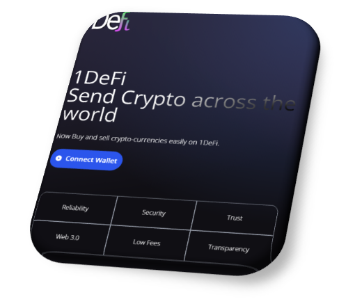
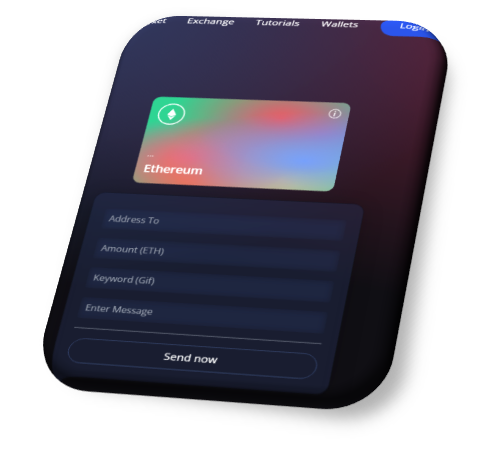

1Defi is a platform that allows users to make payments in digital currency without the need for intermediaries. This means that transactions can be completed quickly and efficiently, without the need for third parties such as banks or payment process.

1Defi is a platform that offers a user-friendly interface for engaging in financial transactions using cryptocurrencies. Compared to other crypto payment platforms, 1Defi's interface is designed to be intuitive and easy to use. A good user interface is important for any platform as it allows users to easily navigate and interact with the system. 1Defi's user interface is designed with this in mind, providing clear and concise information to help users make informed decisions about their financial transactions. Overall, 1Defi's user-friendly interface makes it an attractive option for those looking to engage in financial transactions using cryptocurrencies.
 

1Defi, uses emerging technology to remove third parties and centralised institutions from financial transactions Such as-
Blockchain network
Web 3.0
Metamask
Smart-Contracts
